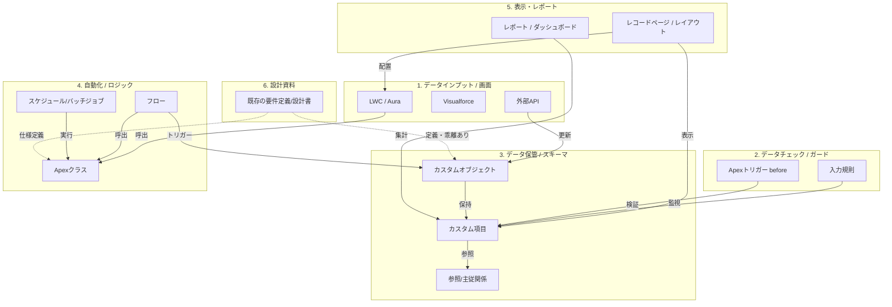

# Salesforce テキストベース・ナレッジグラフ設計図 (Blueprint)

Salesforceの各種メタデータと既存の設計資料を、NotebookLMが正しく解釈できるようにテキストベースの「ナレッジグラフ（関係性マップ）」として整理するための設計図です。

---

## 1. 資源のライフサイクルとノード分類

Salesforceの資源を「データのライフサイクル」および「設定項目」ごとにノード（構成要素）として分類します。



---

## 2. ナレッジグラフを構成する「関係性（エッジ）」の定義

Pythonスクリプトで自動抽出する際、以下の「関係性」を定義してテキストに出力します。

| 始点 (ソース) | 関係性 (エッジ) | 終点 (ターゲット) | 抽出方法（パーサーのロジック） |
| :--- | :--- | :--- | :--- |
| **LWC / Aura** | `CALLS` (呼び出す) | **Apexクラス** | JS内の `@salesforce/apex/Class.method` から抽出 |
| **入力規則** | `VALIDATES` (検証する) | **カスタム項目** | XMLの `<errorConditionFormula>` 内の項目API名を抽出 |
| **Apexトリガー** | `TRIGGERS_ON` (起動する) | **オブジェクト** | トリガーの定義（`trigger X on Object`）から抽出 |
| **フロー** | `UPDATES` (更新する) | **カスタム項目** | フローのXML内 `<recordUpdates>` や `<assignments>` から抽出 |
| **フロー** | `CALLS_APEX` (Apexを呼ぶ)| **Apexクラス** | `<actionCalls>` の `actionName`（`@InvocableMethod`）から抽出 |
| **スケジュールジョブ**| `RUNS` (実行する) | **Apexクラス** | `System.schedule` や `Schedulable` 実装クラスから抽出 |
| **レコードページ** | `HOSTS` (配置する) | **LWC / レイアウト**| FlexiPage XMLの `<componentInstance>` から抽出 |
| **レポート** | `QUERIES` (参照する) | **オブジェクト/項目**| Report XMLの `<columns>` や `<filter>` から抽出 |

---

## 3. NotebookLM向けテキスト表現フォーマット (Markdown Schema)

NotebookLMに「グラフ構造」を認識させるため、以下のようなフォルダ・ファイル構造でMarkdownを出力します。

### ① `schema_map.md` (データ構造と検証・表示のマップ)
オブジェクトを中心に、入力規則やレイアウトの関係性をまとめます。

```markdown
# オブジェクト・ナレッジ: Account (取引先)

## 概要
取引先企業情報を格納する標準オブジェクト。

## 保持する主要項目
* `Name` (テキスト): 取引先名
* `Active__c` (選択リスト): アクティブフラグ [値: Yes, No]
* `AnnualRevenue` (通貨): 年間売上

## データチェック (入力規則)
* **VR_Require_Active_Reason**:
  * 役割: `Active__c` が "No" の場合、不活性理由の入力を必須化する。
  * 監視項目: `Active__c`, `Inactive_Reason__c`

## データ表示 (レイアウト)
* **Account_Layout (ページレイアウト)**:
  * 配置項目: `Name`, `Active__c`, `AnnualRevenue`
* **Account_Record_Page (Lightningレコードページ)**:
  * 配置コンポーネント: `AccountHeaderLWC` (LWC)
```

### ② `logic_flow_map.md` (自動化とロジックのマップ)
処理の流れ（誰がトリガーし、誰を呼び出すか）をマップ化します。

```markdown
# ロジック・自動化マップ

## フロー (Flow)
* **Account_After_Save_Flow** (レコードトリガーフロー)
  * トリガー: `Account` の作成・更新時
  * アクション:
    * `UPDATES` -> `Account.AnnualRevenue` (関連子レコードの合計を算出)
    * `CALLS_APEX` -> `AccountNotificationQueueable` (通知用Apex)

## Apexクラスとトリガー
* **AccountTrigger (ApexTrigger)**:
  * トリガー対象: `Account`
  * 動作フェーズ: `before insert`, `before update`
  * 呼び出しクラス: `AccountTriggerHandler.cls`
* **AccountTriggerHandler.cls (ApexClass)**:
  * 参照項目: `Account.Active__c`
  * 更新項目: `Account.Description`
```

---

## 4. 既存の設計資料とナレッジグラフの「紐付け」

既存の設計書（PDF/Word/Excel等）と、実際のSalesforceメタデータをNotebookLM内で紐付けるため、以下の **「設計書マッピングドキュメント」** を手動または半自動で1つ作成します。

### `design_doc_bridge.md` (設計書と実機の架け橋)

```markdown
# 設計書マッピング・ブリッジ

このドキュメントは、既存の設計資料と実際のSalesforce資源の対応関係を定義します。

## 1. 顧客管理機能
* **対応設計書**: `01_要件定義書_顧客管理_v2.0.pdf`
* **対応メタデータ**:
  * メインオブジェクト: `Account` (取引先)
  * 関連フロー: `Account_After_Save_Flow`
* **設計書との乖離メモ**:
  * 設計書P12では「年間売上は手動入力」とあるが、実際はフロー `Account_After_Save_Flow` によって自動計算されるように改修されている。

## 2. バッチ処理 (夜間同期)
* **対応設計書**: `05_詳細設計書_基幹連携バッチ_v1.5.xlsx`
* **対応メタデータ**:
  * 起動スケジュール: `DailySapSyncJob` (スケジュールジョブ)
  * 実行クラス: `SapIntegrationBatch.cls`
```

---

## 5. NotebookLMでの挙動イメージ（何ができるようになるか）

このテキストベースのグラフ情報がNotebookLMに入ると、以下のような調査が可能になります。

* **質問**: `AnnualRevenue`（年間売上）の計算ロジックはどうなっていますか？設計書と実機で違いはありますか？
* **回答のシミュレーション**:
  > アップロードされた `design_doc_bridge.md` によると、設計書（`01_要件定義書_顧客管理_v2.0.pdf`）では「手動入力」と定義されています。
  > しかし、実際の環境マップ（`logic_flow_map.md`）を確認すると、`Account_After_Save_Flow` というフローによって、レコード作成・更新時に `Account.AnnualRevenue` が自動更新されるロジックが実装されています。この自動更新では子レコードの売上の合計値が算出されているため、実機と設計書に乖離があります。

---

このグラフ構造の設計で、網羅したい資源（入力規則、レイアウト、自動化等）はカバーできていますでしょうか？
問題なければ、この設計に基づいて「実際のメタデータフォルダをスキャンし、上記のMarkdownを生成するPythonスクリプト」の設計に進みます。
